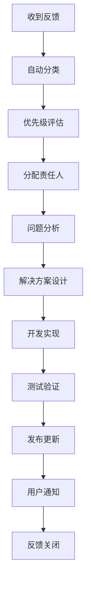

# SDK 持续改进流程

本文档定义了 HotelByte SDK 的持续改进流程，确保 SDK 代码质量持续提升，并建立长期可维护的迭代机制。

## 1. 质量检查流程

### 1.1 自动化质量检查

**每日质量检查**
```bash
# 运行质量检查脚本
./scripts/check-sdk-quality.sh --report

# 检查内容包括：
# - 代码格式检查
# - 静态代码分析
# - 测试覆盖率
# - 文档完整性
# - 版本一致性
```

**质量门禁标准**
- 测试覆盖率 ≥ 80%
- 静态分析零警告
- 所有测试必须通过
- 文档覆盖率 ≥ 90%
- 代码格式符合规范

### 1.2 质量指标追踪

**关键指标**
```yaml
# .github/workflows/quality-metrics.yml
name: Quality Metrics
on:
  schedule:
    - cron: '0 2 * * *'  # 每日凌晨2点
  push:
    branches: [main]
    
jobs:
  collect-metrics:
    runs-on: ubuntu-latest
    steps:
      - uses: actions/checkout@v3
      
      - name: Setup Go
        uses: actions/setup-go@v3
        with:
          go-version: 1.19
          
      - name: Run Quality Check
        run: ./scripts/check-sdk-quality.sh --report
        
      - name: Upload Metrics
        uses: actions/upload-artifact@v3
        with:
          name: quality-report
          path: sdk-quality-report.md
```

**指标仪表板**
- 代码质量得分趋势
- 测试覆盖率变化
- 性能基准对比
- 用户反馈统计

## 2. 版本发布流程

### 2.1 语义化版本管理

**版本号规则**
```
主版本号.次版本号.修订号 (MAJOR.MINOR.PATCH)

- MAJOR: 不兼容的 API 更改
- MINOR: 向后兼容的功能添加
- PATCH: 向后兼容的问题修正
```

**发布检查清单**
```markdown
## 发布前检查

- [ ] 所有测试通过
- [ ] 质量检查得分 ≥ 90%
- [ ] 文档更新完成
- [ ] CHANGELOG 更新
- [ ] 版本号符合语义化规范
- [ ] 向后兼容性验证
- [ ] 示例代码测试通过
- [ ] 性能回归测试通过

## 发布后验证

- [ ] 包管理器发布成功
- [ ] 文档站点更新
- [ ] 示例项目可正常运行
- [ ] 监控指标正常
```

### 2.2 自动化发布流程

**发布流水线**
```yaml
# .github/workflows/release.yml
name: Release
on:
  push:
    tags:
      - 'v*'

jobs:
  quality-gate:
    runs-on: ubuntu-latest
    steps:
      - uses: actions/checkout@v3
      - name: Quality Check
        run: ./scripts/check-sdk-quality.sh
        
  release:
    needs: quality-gate
    runs-on: ubuntu-latest
    steps:
      - uses: actions/checkout@v3
      
      - name: Create Release
        uses: actions/create-release@v1
        with:
          tag_name: ${{ github.ref }}
          release_name: Release ${{ github.ref }}
          
      - name: Update Documentation
        run: ./scripts/update-docs.sh
        
      - name: Notify Users
        run: ./scripts/notify-release.sh
```

## 3. 用户反馈收集

### 3.1 反馈渠道

**多渠道收集**
- GitHub Issues (Bug 报告、功能请求)
- GitHub Discussions (使用问题、讨论)
- 用户调研问卷
- 社区论坛反馈
- 客户支持反馈

**反馈分类**
```go
type FeedbackCategory string

const (
    BugReport      FeedbackCategory = "bug"
    FeatureRequest FeedbackCategory = "feature"
    Documentation  FeedbackCategory = "docs"
    Performance    FeedbackCategory = "performance"
    Usability      FeedbackCategory = "usability"
    Integration    FeedbackCategory = "integration"
)

type Feedback struct {
    ID          string           `json:"id"`
    Category    FeedbackCategory `json:"category"`
    Priority    Priority         `json:"priority"`
    Title       string           `json:"title"`
    Description string           `json:"description"`
    UserType    string           `json:"user_type"`
    SDKVersion  string           `json:"sdk_version"`
    CreatedAt   time.Time        `json:"created_at"`
    Status      FeedbackStatus   `json:"status"`
}
```

### 3.2 反馈处理流程

**优先级评估**
```
P0 (紧急): 阻塞性问题，24小时内响应
P1 (高): 重要功能问题，3天内响应  
P2 (中): 一般改进建议，1周内响应
P3 (低): 优化建议，1个月内响应
```

**处理工作流**


## 4. 技术债务管理

### 4.1 债务识别

**定期审计**
```bash
#!/bin/bash
# scripts/tech-debt-audit.sh

echo "=== 技术债务审计 ==="

# 代码复杂度分析
echo "代码复杂度分析:"
gocyclo -over 10 .

# TODO/FIXME 统计
echo "待办事项统计:"
grep -r "TODO\|FIXME\|HACK" --include="*.go" .

# 代码重复检测
echo "代码重复检测:"
jscpd --languages go .

# 依赖漏洞扫描
echo "依赖漏洞扫描:"
govulncheck ./...
```

**债务分类**
```yaml
technical_debt:
  categories:
    - name: "代码质量"
      items:
        - "复杂度过高的函数"
        - "代码重复"
        - "命名不规范"
        
    - name: "架构设计"
      items:
        - "模块耦合度高"
        - "接口设计不合理"
        - "扩展性差"
        
    - name: "测试覆盖"
      items:
        - "缺少单元测试"
        - "集成测试不足"
        - "边界条件未覆盖"
        
    - name: "文档维护"
      items:
        - "API 文档过时"
        - "示例代码错误"
        - "最佳实践缺失"
```

### 4.2 债务偿还计划

**偿还策略**
```go
type DebtItem struct {
    ID          string    `json:"id"`
    Category    string    `json:"category"`
    Description string    `json:"description"`
    Impact      Impact    `json:"impact"`      // High, Medium, Low
    Effort      Effort    `json:"effort"`      // High, Medium, Low
    Priority    int       `json:"priority"`    // 计算得出
    CreatedAt   time.Time `json:"created_at"`
    TargetDate  time.Time `json:"target_date"`
    Status      string    `json:"status"`
}

// 优先级计算: Priority = Impact Score + Urgency Score - Effort Score
func (d *DebtItem) CalculatePriority() int {
    impactScore := map[Impact]int{High: 3, Medium: 2, Low: 1}
    effortScore := map[Effort]int{High: 3, Medium: 2, Low: 1}
    
    return impactScore[d.Impact] - effortScore[d.Effort]
}
```

**每月债务偿还目标**
- 高优先级债务: 解决 2-3 个
- 中优先级债务: 解决 3-5 个  
- 低优先级债务: 解决 5-10 个

## 5. 性能监控和优化

### 5.1 性能基准测试

**基准测试套件**
```go
// benchmark_test.go
func BenchmarkClientCreation(b *testing.B) {
    for i := 0; i < b.N; i++ {
        client, _ := hotelbyte.NewClient(
            hotelbyte.WithCredentials("test-key", "test-secret"),
        )
        client.Close()
    }
}

func BenchmarkSearchHotels(b *testing.B) {
    client, _ := hotelbyte.NewClient(
        hotelbyte.WithCredentials("test-key", "test-secret"),
    )
    defer client.Close()
    
    req := &hotelbyte.SearchHotelsRequest{
        DestinationID: "beijing",
        CheckIn:       time.Now().AddDate(0, 0, 7),
        CheckOut:      time.Now().AddDate(0, 0, 9),
        AdultCount:    2,
        RoomCount:     1,
    }
    
    b.ResetTimer()
    for i := 0; i < b.N; i++ {
        _, _ = client.SearchHotels(context.Background(), req)
    }
}
```

**性能回归检测**
```bash
#!/bin/bash
# scripts/performance-regression.sh

# 运行基准测试
go test -bench=. -benchmem -count=3 -run=^$ > current_bench.txt

# 与基线对比
benchcmp baseline_bench.txt current_bench.txt

# 如果性能下降超过10%，则报警
python scripts/check_performance_regression.py
```

### 5.2 实时性能监控

**监控指标**
```yaml
# monitoring/prometheus.yml
metrics:
  - name: sdk_request_duration_seconds
    help: "SDK request duration in seconds"
    type: histogram
    
  - name: sdk_request_total
    help: "Total SDK requests"
    type: counter
    
  - name: sdk_error_total
    help: "Total SDK errors"
    type: counter
    
  - name: sdk_active_connections
    help: "Active HTTP connections"
    type: gauge
```

**告警规则**
```yaml
# monitoring/alerts.yml
groups:
  - name: sdk_performance
    rules:
      - alert: HighLatency
        expr: histogram_quantile(0.95, sdk_request_duration_seconds) > 5
        for: 5m
        annotations:
          summary: "SDK request latency is high"
          
      - alert: HighErrorRate
        expr: rate(sdk_error_total[5m]) > 0.1
        for: 2m
        annotations:
          summary: "SDK error rate is high"
```

## 6. 社区贡献管理

### 6.1 贡献者指南

**贡献流程**
```markdown
## 贡献步骤

1. **准备**
   - Fork 项目仓库
   - 创建功能分支
   - 设置开发环境

2. **开发**
   - 遵循代码规范
   - 编写测试用例
   - 更新文档

3. **提交**
   - 提交 Pull Request
   - 通过代码审查
   - 合并到主分支

## 代码审查标准

- [ ] 代码风格符合规范
- [ ] 测试覆盖率足够
- [ ] 文档更新完整
- [ ] 无安全漏洞
- [ ] 性能无回归
```

### 6.2 社区健康度量

**健康指标**
```go
type CommunityMetrics struct {
    ActiveContributors    int       `json:"active_contributors"`
    MonthlyCommits       int       `json:"monthly_commits"`
    OpenIssues           int       `json:"open_issues"`
    AvgIssueResponseTime duration  `json:"avg_issue_response_time"`
    AvgPRMergeTime       duration  `json:"avg_pr_merge_time"`
    CommunityGrowthRate  float64   `json:"community_growth_rate"`
}

func (m *CommunityMetrics) HealthScore() float64 {
    // 计算社区健康度得分
    score := 0.0
    
    // 活跃贡献者得分 (30%)
    if m.ActiveContributors >= 10 {
        score += 30
    } else {
        score += float64(m.ActiveContributors) * 3
    }
    
    // 响应时间得分 (25%)
    if m.AvgIssueResponseTime.Hours() <= 24 {
        score += 25
    } else if m.AvgIssueResponseTime.Hours() <= 72 {
        score += 15
    }
    
    // 其他指标...
    
    return score
}
```

## 7. 文档维护流程

### 7.1 文档同步机制

**自动同步**
```yaml
# .github/workflows/docs-sync.yml
name: Documentation Sync
on:
  push:
    paths:
      - 'sdk/**/*.go'
      - 'docs/**/*.md'
      
jobs:
  sync-docs:
    runs-on: ubuntu-latest
    steps:
      - uses: actions/checkout@v3
      
      - name: Generate API Docs
        run: |
          go run scripts/generate-api-docs.go
          
      - name: Update Examples
        run: |
          ./scripts/update-examples.sh
          
      - name: Validate Links
        run: |
          markdown-link-check docs/**/*.md
```

### 7.2 文档质量检查

**检查标准**
```bash
#!/bin/bash
# scripts/check-docs-quality.sh

echo "检查文档质量..."

# 检查拼写错误
aspell check docs/**/*.md

# 检查链接有效性
markdown-link-check docs/**/*.md

# 检查代码示例
./scripts/validate-code-examples.sh

# 检查文档覆盖率
./scripts/check-docs-coverage.sh
```

## 8. 总结

通过建立完善的持续改进流程，我们能够：

1. **保证质量**：自动化质量检查确保代码质量持续提升
2. **快速响应**：及时处理用户反馈和问题
3. **技术演进**：有计划地偿还技术债务
4. **性能优化**：持续监控和优化性能
5. **社区发展**：促进开源社区健康发展
6. **文档同步**：保持文档与代码同步更新

这个流程将确保 HotelByte SDK 能够持续改进，为用户提供更好的开发体验。